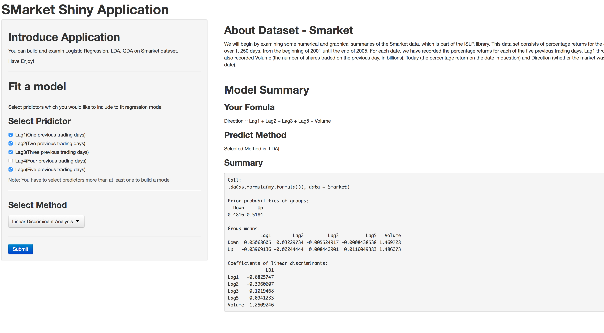

## Introduce Smarket ShinyApp

* You can build and test three of classification model, Logisitic Regression, LDA, QDA with selecting predictors



### The Shiny Application : [Smarekt Shiny App](https://yonghee.shinyapps.io/smarketShinyApp/)

1. 
2. Write using R Markdown
3. Use an empty line followed by three dashes to separate slides!

--- .class #id 

## Explorer Smarket Dataset
* This data set consists of percentage returns for the S&P 500 stock index over 1, 250 days. For each date, we have recorded the percentage returns for each of the five previous trading days, Lag1 through Lag5. We have also recorded Volume (the number of shares traded on the previous day, in billions), Today (the percentage return on the date in question) and Direction (whether the market was Up or Down on this date).

```{r echo=FALSE}
library(ISLR)
summary(Smarket)
```

---

## What can we do with this Smarekt Shiny App?

- You can build a model with predictors you select.
    - We will make formula from your select
- You can choose one of three method(Logistic, LDA, QDA).
- You can see summary(coeff, P-val..) of model you built.
```{r echo=FALSE}
my.fit <- glm(Direction ~ Lag1 + Lag2 + Volume, data=Smarket,family = binomial)
summary(my.fit)
```

---

## How can we use this Smarket Shiny App?

- First, You have to select predictors that Lag1 ~ Lag5
- Secont, Select method you want to test. We support Logistic Regression , LDA, QDA
- Finaly Press the Submit button


