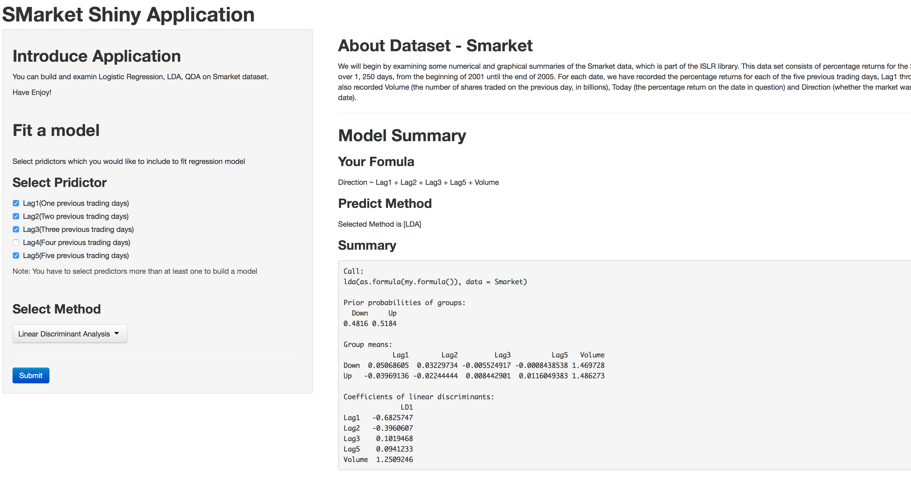

## Introduce Smarket ShinyApp

* You can build and test three of classification model, Logisitic Regression, LDA, QDA with selecting predictors



### The Shiny Application : [Smarekt Shiny App](https://yonghee.shinyapps.io/smarketShinyApp/)

1. 
2. Write using R Markdown
3. Use an empty line followed by three dashes to separate slides!

--- .class #id 

## Explorer Smarket Dataset
* This data set consists of percentage returns for the S&P 500 stock index over 1, 250 days. For each date, we have recorded the percentage returns for each of the five previous trading days, Lag1 through Lag5. We have also recorded Volume (the number of shares traded on the previous day, in billions), Today (the percentage return on the date in question) and Direction (whether the market was Up or Down on this date).


```
##       Year           Lag1             Lag2             Lag3       
##  Min.   :2001   Min.   :-4.922   Min.   :-4.922   Min.   :-4.922  
##  1st Qu.:2002   1st Qu.:-0.640   1st Qu.:-0.640   1st Qu.:-0.640  
##  Median :2003   Median : 0.039   Median : 0.039   Median : 0.038  
##  Mean   :2003   Mean   : 0.004   Mean   : 0.004   Mean   : 0.002  
##  3rd Qu.:2004   3rd Qu.: 0.597   3rd Qu.: 0.597   3rd Qu.: 0.597  
##  Max.   :2005   Max.   : 5.733   Max.   : 5.733   Max.   : 5.733  
##       Lag4             Lag5            Volume          Today       
##  Min.   :-4.922   Min.   :-4.922   Min.   :0.356   Min.   :-4.922  
##  1st Qu.:-0.640   1st Qu.:-0.640   1st Qu.:1.257   1st Qu.:-0.640  
##  Median : 0.038   Median : 0.038   Median :1.423   Median : 0.038  
##  Mean   : 0.002   Mean   : 0.006   Mean   :1.478   Mean   : 0.003  
##  3rd Qu.: 0.597   3rd Qu.: 0.597   3rd Qu.:1.642   3rd Qu.: 0.597  
##  Max.   : 5.733   Max.   : 5.733   Max.   :3.152   Max.   : 5.733  
##  Direction 
##  Down:602  
##  Up  :648  
##            
##            
##            
## 
```

---

## What can we do with this Smarekt Shiny App?

- You can build a model with predictors you select.
    - We will make formula from your select
- You can choose one of three method(Logistic, LDA, QDA).
- You can see summary(coeff, P-val..) of model you built.

```
## 
## Call:
## glm(formula = Direction ~ Lag1 + Lag2 + Volume, family = binomial, 
##     data = Smarket)
## 
## Deviance Residuals: 
##    Min      1Q  Median      3Q     Max  
##  -1.45   -1.20    1.07    1.15    1.33  
## 
## Coefficients:
##             Estimate Std. Error z value Pr(>|z|)
## (Intercept)  -0.1206     0.2402   -0.50     0.62
## Lag1         -0.0733     0.0502   -1.46     0.14
## Lag2         -0.0428     0.0501   -0.85     0.39
## Volume        0.1318     0.1580    0.83     0.40
## 
## (Dispersion parameter for binomial family taken to be 1)
## 
##     Null deviance: 1731.2  on 1249  degrees of freedom
## Residual deviance: 1727.7  on 1246  degrees of freedom
## AIC: 1736
## 
## Number of Fisher Scoring iterations: 3
```

---

## How can we use this Smarket Shiny App?

- First, You have to select predictors that Lag1 ~ Lag5
- Secont, Select method you want to test. We support Logistic Regression , LDA, QDA
- Finaly Press the Submit button


